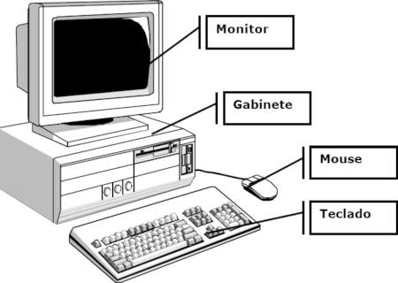
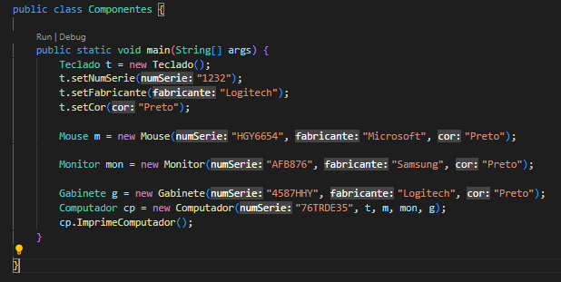
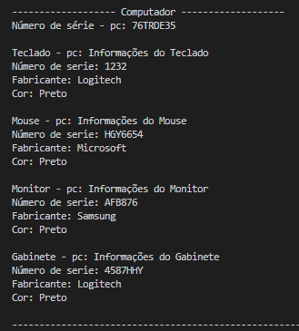

## Código - Componentes de Computadores 💻

  

### Java POO ☕

Código desenvolvido com base em uma atividade da faculdade. Podemos alimentar o sistema com informações sobre as peças que compõem um determinado computador e deixar salvo no sistema para consultar as características detalhadas do mesmo.

<strong>O programa vai exibir na telas as seguintes informações:</strong>

- [x] Número de série do computador
- [x] Dados detalhados de cada peça do computador (teclado, mouse, monitor e gabinete)
  
## Compilação 👨🏽‍💻

### Inserindo dados no sistema 💻⬅

  

## Preview - Tela de consulta 🔎

  

## Tecnologias 🛠

- Java POO ☕

## Aluno 👨🏽‍🎓

- <a target="_blank" href="https://www.linkedin.com/in/ramon-barreto-076191180/">Ramon Barreto</a>

## Contato 📲

- Email: ramon_barreto_medrado@hotmail.com